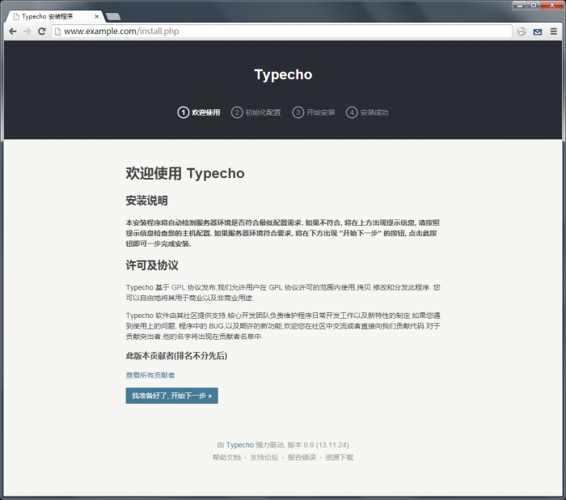

### 安装环境要求
- PHP 7.2 以上
- MySQL, PostgreSQL, SQLite 任意一种数据库支持，并在 PHP 中安装了相关扩展
- CURL 扩展支持
- mbstring 或 iconv 扩展支持

### 下载最新版
请访问 http://typecho.org/download 获得最新的稳定版本，并下载

### 解压缩安装包
解压缩后你会看到如下的目录结构
```
/admin/
/install/
/usr/
/var/
/license.txt  
/index.php
/install.php
```

### 上传至服务器WEB目录
将上面列出的所有文件和目录上传到服务器上的指定目录，如`DocumentRoot`目录或者任何你希望安装`typecho`的目录。

### 访问你的blog地址
上传完毕后使用浏览器直接访问安装目录即可看到`Typecho`的安装程序。恭喜，你的服务器可以完美支持typecho，点击进入下一步。


### 填写配置信息
按照程序安装向导的要求填写相关服务器参数和初始化设置信息，完成后点击下一步。

### 完成安装
在安装成功界面中会显示自动生成的初始登录密码，请务必牢记或马上进入后台按提示更改。已经大功告成，祝您`Typecho`使用愉快！:)

> 万一不慎丢失初始密码可以删除安装目录下生成的`config.inc.php`文件，然后重新安装选择保留原有数据库即可。